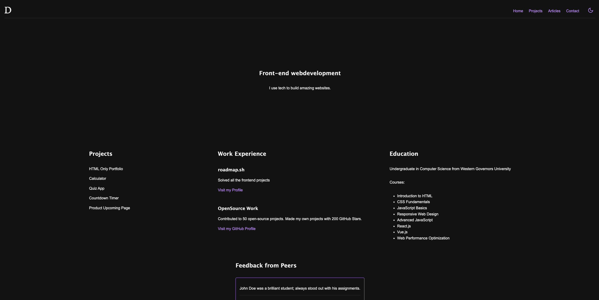

# POC of a dark/light theme switcher

## Description

This project is a proof of concept for implementing dark and light themes in a website using HTML, CSS, and JavaScript.



## Features

- Toggle between dark and light themes
- Responsive design
- Smooth transitions between themes

## Installation

1. Clone the repository:
   ```sh
   git clone https://github.com/yourusername/poc-dark-light-theme-html.git
   ```
2. Navigate to the project directory:
   ```sh
   cd poc-dark-light-theme-html
   ```

## Usage

Open the `index.html` file in your web browser to view the website. Use the theme toggle button to switch between dark and light themes.

## Contributing

Contributions are welcome! Please fork the repository and create a pull request with your changes.

## License

This project is licensed under the [MIT License](LICENSE.md).
